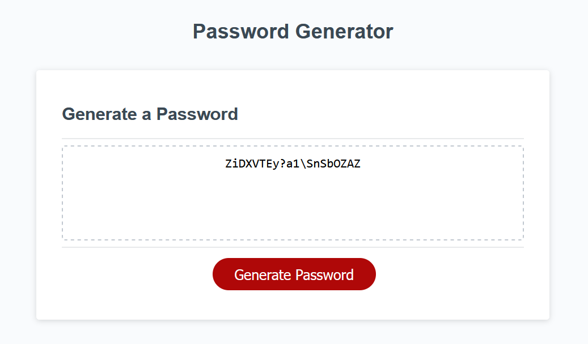

# 🗝️ Password Generator 🗝️

Welcome to the Password Generator App! This application empowers users to create fully customized, randomized passwords.

## 🚀 Live Version

Experience the live version of the Password Generator [HERE](https://thevisualriot.github.io/password-generator/)

## 📝 Description
The Password Generator is a web application developed using HTML, CSS, and JavaScript. It facilitates the random generation of a secure password, tailored to the user's preferences regarding:
    - Length of the password
    - Use of special characters
    - Use of numeric characters
    - Use of lowercase characters
    - Use of uppercase characters

## 🧠 The Logic
Before delving into the JavaScript functionality code, I approached the problem methodically, following this pseudo code:

1. **Error Handling:** Check for wrong input (other than numbers between 8 and 128):
   - Prompt an error message and reload the page

2. Create empty arrays to store a new array with all selected options chosen by the user (`passwordArray`).

3. Create empty variables for the generated password (`generatedPassword`) and the password length (`passwordLength`).

4. When the button is clicked, run a function `RunGenerator()`:
   - Pop up a confirm boxes for various options
   - If true, add to the new password array

5. If nothing was added to the `passwordArray` (user selected only "NO" in all options):
   - Prompt an error message and reload the page
   - Otherwise:
     - Add random indices of `passwordArray` to the `generatedPassword` variable as a string with the length selected by the user (stored in `passwordLength` variable)

6. Output the generated password to the HTML box

## 💻 JS Elements

The JavaScript code for the Password Generator encompasses the following key aspects:

### Character Set Arrays
Utilizing separate arrays for special characters, numeric characters, lowercase characters, and uppercase characters enhances the diversity of the generated passwords.

### Variables
Key variables, such as `passwordLength`, `passwordArray`, and `generatedPassword`, play pivotal roles in managing user input and the password generation process.

### Event Listener
The 'Generate' button is linked to a click event, activating the primary function, `runGenerator`, which orchestrates the entire password generation process.

### Functions
The code is structured around various functions that handle essential tasks:
- **`getPasswordOptions`**: Prompts users for password options and updates the password array based on their choices.
- **`generatePassword`**: Creates a randomized password using the selected character sets and specified length.
- **`writePassword`**: Displays the generated password in the HTML password input field.
- **`runGenerator`**: The main function that drives the entire password generation process, from user prompts to output.

## 📜 License
This project is licensed under the [MIT License](https://choosealicense.com/licenses/mit/)
